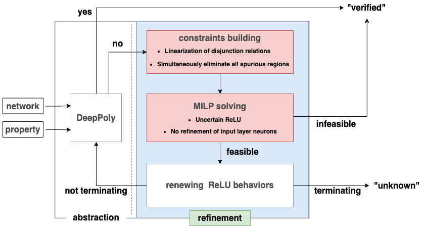

## DeepMR

DeepMR: Multi-fold Acceleration Refinement for Deep Neural Network Verification.

- Introduces DeepMR, a novel method for accelerating refinement in neural network verification.
- Linearizes disjunctive inequality constraints and employs integer programming to eliminate spurious regions corresponding to adversarial labels.
- Targets uncertain ReLU neurons in intermediate layers to reduce the scale of optimization, improving efficiency.
- Validated on diverse datasets, including MNIST, CIFAR10, and ACAS Xu, demonstrating superior efficiency compared to other iterative refinement tools.
- Demonstrates up to a 97-fold speedup in verification on datasets like CIFAR10.
  
  
  
  
  
  

### Folders

- **mnsit_properties**, **cifar_properties**, and **acas_properties**: Store properties to be verified for MNIST, CIFAR10, and ACASXU, respectively. These properties can be classified by models ready for verification.

- **models**: Stores the neural network models to be verified.

- **multipath_bp**: Contains the code required to run the aCROWN and MPBP algorithms.

- **original_data_log_files_in_paper**: Contains all the original data and code execution log files from the paper, as well as the analyzed data after refinement.

- **paper_example**: Contains two examples from the paper, DeepSRGR and DeepMR.

- **result**: Saves experiment logs and results. Data from the paper are organized in the `original_data_log_files_in_paper` folder.

- **utils**: Contains some utility code functions for saving experimental results.

- **verify**: Used for experiments of the verification algorithm, including aCROWN, DeepPoly, DeepSRGR, MPBP, and DeepMR.

### Usage

- Run `deepmr_mnist_new_10x80_3.py` to obtain the verification result of DeepMR on the mnist10x80 network.
- Running other Python files will provide verification results for specific algorithms.

### Notes

- The Python runtime environment is specified in the `requirements.txt` file.

- Parts related to the linear programming solver in DeepMR and DeepSRGR are parallelized.

- Default settings: WORKERS=28 processes and 5 iterations.

- Default solver: Gurobi 11, but other solvers can be used.